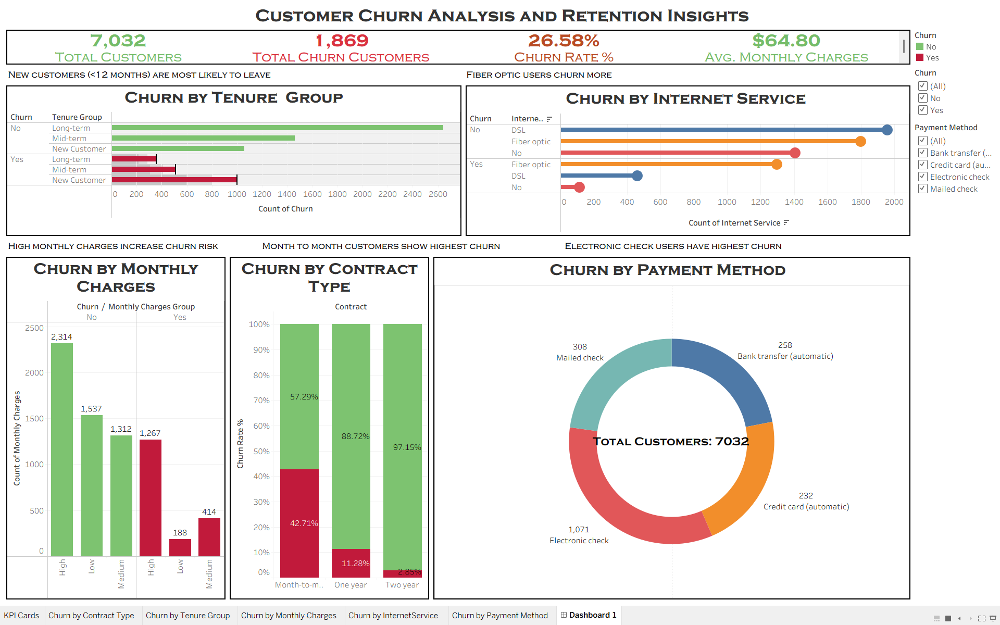

# 📊 Customer Churn Analysis

## 🎥 Dashboard Walkthrough
[▶️ Watch the dashboard video](./Dashboard_walkthrough.mp4)

## 🔍 Project Overview
This project analyzes customer churn behavior in a telecom company to identify key factors contributing to customer loss and provide actionable insights for improving retention.

## 📁 Dataset
- Source: Telco Customer Churn Dataset
- Total Records: 7,032
- Features: Customer demographics, services, billing, and churn status

## 🛠️ Tools Used
- Excel (Data Cleaning & Feature Engineering)
- Tableau (Dashboard & Visualization)

## 🔄 Data Preparation
- Removed missing values from TotalCharges
- Converted data types
- Created new features:
  - Tenure Group (New, Mid-term, Long-term)
  - Monthly Charges Group (Low, Medium, High)
  - Total Services Count

## 📊 Key Insights

- 📌 Customers with **month-to-month contracts** have the highest churn rate  
- 📌 **New customers (<12 months)** are more likely to churn  
- 📌 **High monthly charges** increase churn risk  
- 📌 **Fiber optic users** show higher churn compared to DSL  
- 📌 Customers using **electronic check** have the highest churn  

## 📈 Dashboard Features
- KPI Cards (Total Customers, Churn Count, Churn Rate, Avg Charges)
- Churn Analysis by:
  - Contract Type
  - Tenure Group
  - Monthly Charges
  - Internet Service
  - Payment Method
- Interactive Filters
  

## 🎯 Conclusion
The analysis highlights pricing, contract type, and service usage as key drivers of churn. Businesses can reduce churn by promoting long-term contracts, improving onboarding for new customers, and addressing issues in high-risk segments.
----
